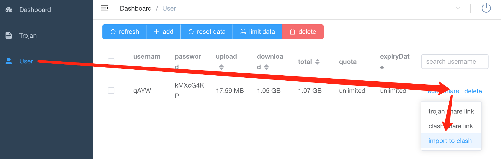

# trojan

This repository provides a proxy solution for users in China to access international services securely and efficiently using the **trojan** protocol.

## Introduction

[**Trojan**](https://trojan-gfw.github.io/trojan/) is an open-source proxy tool designed to bypass internet censorship and provide secure, undetectable access to blocked services. It leverages HTTPS to disguise traffic as regular web browsing, making it difficult for firewalls to detect or block.

- **Principles**: Trojan uses TLS encryption to make proxy traffic indistinguishable from normal HTTPS traffic. This helps evade deep packet inspection and active probing commonly used in restrictive networks.
- **Official Documentation**:  
  - [Trojan GitHub Repository](https://github.com/trojan-gfw/trojan)  
  - [Trojan Protocol Documentation](https://trojan-gfw.github.io/trojan/)

## Server Configuration

### Installation

To install trojan, run the following command in your terminal:

```sh
source <(curl -sL https://raw.githubusercontent.com/iltyty/trojan/refs/heads/master/install.sh)
```

This installation script will:

- Check your system for compatibility and required privileges (must be run as root, supports x86_64 and aarch64).
- Detect your package manager and install necessary dependencies
- Download and install the latest trojan binary for your architecture.
- Set up trojan as a systemd service for automatic management.
- Add shell completion for trojan commands.
- Configure a cron job for certificate renewal and service restart.
- If updating, migrate configuration and restart services as needed.

If you use the `--remove` option, the script will uninstall trojan, remove all related files, services, and Docker containers, and clean up your shell configuration.

### Uninstallation

To remove trojan, use:

```sh
source <(curl -sL https://raw.githubusercontent.com/iltyty/trojan/refs/heads/master/install.sh) --remove
```

## Client Configuration

### Setup Clash for Windows for Mac

Clash for Windows is a proxy client supporting multiple protocols including Trojan.

1. First download the zip file according to your Mac's cpu arch:

```bash
# check your system arch
uname -m
# or if you're using Windows
echo %PROCESSOR_ARCHITECTURE%

# if it's arm64
curl -O https://github.com/clashdownload/Clash_for_Windows/releases/download/0.20.39/Clash.for.Windows-0.20.39-arm64-mac.7z

# if it's amd64
curl -O https://github.com/clashdownload/Clash_for_Windows/releases/download/0.20.39/Clash.for.Windows-0.20.39-mac.7z
```

2. Uncompress the 7z file and install the application.

3. Go to your server domain.

4. Click User -> share -> import to clash
   
   
   
   There should be a new profile in the Clash for Windows -> Profile now.
   

### Setup terminal

Run the following command:

```bash
# Run this if you're using zsh
echo "alias p=\"export http_proxy='http://localhost:7890'; export https_proxy='http://localhost:7890'\"" >> ~/.zshrc
source ~/.zshrc

# Or if you're using bash
echo "alias p=\"export http_proxy='http://localhost:7890'; export https_proxy='http://localhost:7890'\"" >> ~/.bashshrc
source ~/.bashrc
```

Now everytime you want to access claude, run this command first:

```bash
p
```

Then you should be able to access Claude Code:

```bash
claude
```

Happing coding!